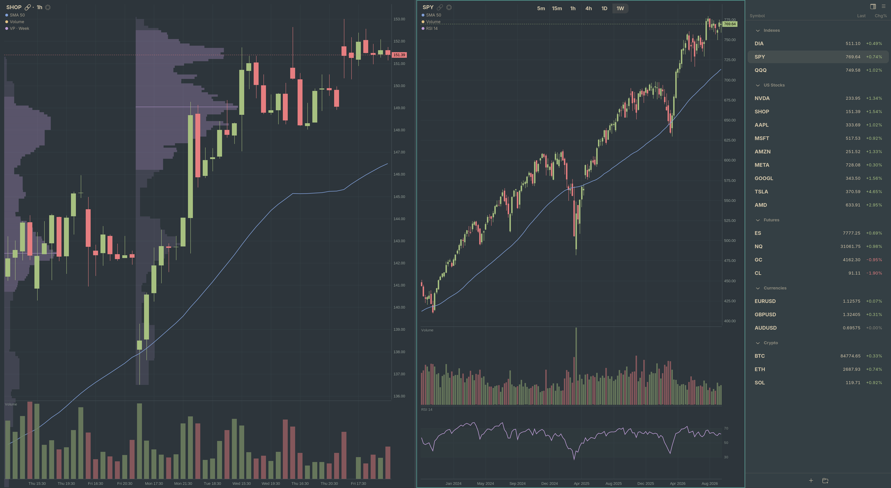

# Omacharts

Fast, beautiful market charts for the Linux desktop.



For looking at charts quickly, at a high level — lots of symbols, higher
timeframes, nothing in the way of the drawing. Not a trading tool: no orders,
no broker, no P&L.

## Features

- **Fast.** Launches in under 200ms and keeps every series it has fetched, so
  arrowing down a watchlist redraws instantly rather than loading.
- **It wears your theme.** Follows the Omarchy desktop theme as you change it —
  and generates an indicator palette for whichever theme is active, so overlays
  come out distinguishable, legible against the candles, and harmonious with
  everything else on screen. Any of the 22 themes, including the awkward ones.
- **Tiled charts.** Split horizontally or vertically, as deep as you like. Each
  chart keeps its own symbol, resolution, indicators and settings.
- **Linked or parked.** Linked charts follow the watchlist together; unlink one
  and it stays where you left it.
- **Keyboard first.** Type a letter to find a symbol, a number to set a
  resolution.
- **Indicators** — moving averages, VWAP with bands, volume, volume profile,
  RSI, ATR — each in its own resizable strip.
- **A bar widget** for the Omarchy bar: your watchlist with sparklines, live,
  still there after the window closes.

## Installing

Needs Rust, GTK 4 and libadwaita.

```sh
git clone https://github.com/jorgemanrubia/omacharts
cd omacharts
cargo build --release
./bin/install
```

## Data

Yahoo Finance's public endpoint — no account, no key — cached locally in
SQLite. Prices are delayed about 15 minutes, which is invisible on the
timeframes this is built for. Not affiliated with Yahoo.

## Known limits

The symbol inventory is a curated few hundred instruments compiled into the
binary; search will not find anything outside it. A full inventory built from
exchange listings is planned. Futures are continuous contracts only.

## Licence

MIT. See [LICENSE](LICENSE).

## From a terminal

Everything the window can do, `omacharts` can do from a command line — and a
command takes effect in a window that is already open, straight away.

```
omacharts watchlist create Semis
omacharts watchlist add Semis NVDA AMD AVGO TSM MU
```

See [doc/cli.md](doc/cli.md), or `omacharts surface --json` for the whole
command surface in a form a script can read.
