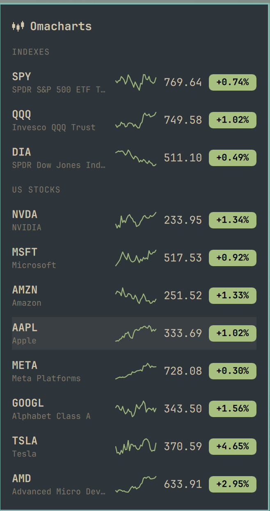

# Omacharts

Fast, beautiful market charts for [Omarchy](https://omarchy.org).

<p align="center">
  
  
</p>

## Features

- **Fast.** Instant load, rendering and interactions. The pillar for everything
  else.
- **Beautiful.** The charts are the protagonists and the user interface is at
  their service. It follows your Omarchy theme as you change it, and generates
  an indicator palette for whichever theme is active, so things look great
  without you having to be an artist.
- **Configurable layout.** Split a chart horizontally or vertically, as deep as
  you like, and resize the panes with the mouse or the keyboard. Each chart
  keeps its own symbol, resolution, indicators and settings. Keep as many
  arrangements as you want as chartbooks, each with its own watchlist, and
  switch between them from the strip along the bottom. Link charts and
  watchlists as you need to. It all comes back the way you left it.
- **Keyboard first.** An intuitive, discoverable user interface, prepared for
  power users. Hotkeys for the whole app: split and close charts, resize them,
  walk the chartbooks, step the resolution, rotate the watchlists. Type a
  letter to find a symbol, a number to set a resolution. Press `?` to learn it all.
- **Indicators.** Moving averages, VWAP with bands, volume, volume profile,
  RSI and ATR, each in its own resizable strip. More coming.
- **A bar widget** for the Omarchy bar: your watchlist with sparklines, live,
  still there after the window closes.
- **Agent ready.** A rich CLI covers everything the window does, and says what
  it can do in a form a script or an agent can read.

## Installing

Needs Rust, GTK 4 and libadwaita.

```sh
git clone https://github.com/jorgemanrubia/omacharts
cd omacharts
cargo build --release
./bin/install
```

## Data

Omacharts is prepared to work with multiple data providers, but at launch only
Yahoo Finance is supported.

We are interested in adding more feeds, both free and paid. If you want to see
yours supported, please create a Pull Request.

## From a terminal

Everything the window can do, `omacharts` can do from a command line, and a
command takes effect in a window that is already open, straight away.

```
omacharts watchlist create Semis
omacharts watchlist add Semis NVDA AMD AVGO TSM MU
```

See [doc/cli.md](doc/cli.md), or `omacharts surface --json` for the whole
command surface in a form a script can read.

## From an agent

Any agent can drive this app as well as a person can: `omacharts surface --json`
describes every command and argument in a form meant to be parsed, and
[AGENTS.md](AGENTS.md) covers the conventions, which Claude and Codex both read.

What is left is discovery, so Omacharts ships a skill that makes an agent reach
for it when you say "what's semis doing" or "set me up for the open". It
installs for whichever agents you have:

```sh
omacharts skill install
```

See `omacharts skill --help`, or
[doc/cli.md](doc/cli.md#teaching-an-agent-about-this-app).

## Roadmap

Rough order, and nothing here is a promise.

- [ ] **Beautiful annotations.** Trendlines, levels and notes that stay where
      you put them, and look like they belong on the chart rather than on top
      of it.
- [ ] **More data feeds.** Yahoo is one provider behind one interface. Others
      can sit behind the same one, including the paid ones with real-time
      prices.
- [ ] **More indicators.** MACD and Bollinger bands are the obvious gaps.
- [ ] ...

Pull requests are welcome.

## Licence

MIT. See [LICENSE](LICENSE).
